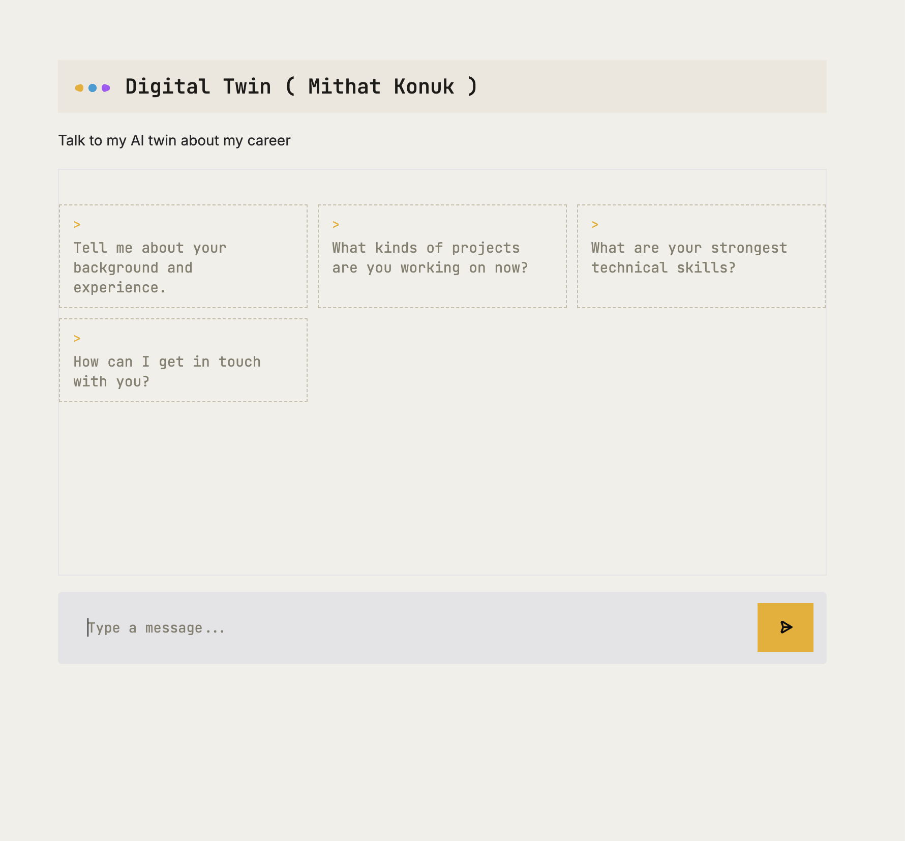

# twin

A digital twin of my career — an AI chatbot that represents me on my personal website and answers visitor questions about my background, skills, and experience, in my voice.



## How it works

The app is a [Gradio](https://www.gradio.app/) chat UI backed by an LLM (via [OpenRouter](https://openrouter.ai/)). On startup it builds a system prompt from two sources of context about me:

- [`summary.txt`](summary.txt) — a short, hand-written bio
- [`linkedin.pdf`](linkedin.pdf) — my LinkedIn profile, exported as a PDF and parsed at runtime with `pypdf`

That context is assembled into `TWIN_SYSTEM_PROMPT` in [`context.py`](context.py), which instructs the model to:

- stay in character as my digital twin and only discuss career/background/skills topics
- ask for a visitor's email and record it (via a tool call) if they want to get in touch
- record any question it couldn't answer, rather than making something up

The model can call two tools, defined in [`tools.json`](tools.json) and validated/loaded by [`tool_loader.py`](tool_loader.py), and implemented in [`tools.py`](tools.py):

| Tool | Purpose |
| --- | --- |
| `record_user_details` | Records a visitor's email (and optional name/notes) when they want to be contacted |
| `record_unknown_question` | Records a question the twin couldn't answer |

Both tools push a notification to my phone via [Pushover](https://pushover.net/) so I see follow-up requests and knowledge gaps in real time.

[`app.py`](app.py) wires it all together: it sends the conversation to the model, runs the tool-calling loop when the model requests a tool, and serves the result through a styled `gr.ChatInterface` (custom CSS/JS/theme colors live in [`styles.py`](styles.py)).

## Project layout

```
app.py           # Entry point: OpenAI/OpenRouter client, chat loop, Gradio UI
context.py       # Builds the system prompt from summary.txt + linkedin.pdf
tools.py         # Tool implementations (record_user_details, record_unknown_question)
tool_loader.py   # Loads + validates tools.json into OpenAI-style tool schemas
tools.json       # Tool (function-calling) schema definitions
styles.py        # CSS/JS/theme + example prompts for the Gradio UI
summary.txt      # Short bio used as part of the twin's context
linkedin.pdf     # LinkedIn export, parsed for additional context
```

## Setup

Requires Python 3.13+.

1. Install dependencies:

   ```bash
   # using uv (reads pyproject.toml / uv.lock)
   uv sync

   # or with pip
   pip install -r requirements.txt
   ```

2. Create a `.env` file in the project root with:

   ```
   OPENROUTER_API_KEY=your_openrouter_api_key
   OPENROUTER_BASE_URL=https://openrouter.ai/api/v1
   PUSHOVER_USER=your_pushover_user_key
   PUSHOVER_TOKEN=your_pushover_app_token
   ```

   - `OPENROUTER_API_KEY` / `OPENROUTER_BASE_URL` — used to call the LLM via [OpenRouter](https://openrouter.ai/). The app defaults to the `openrouter/free` model (see `MODEL_NAME` in [`app.py`](app.py)).
   - `PUSHOVER_USER` / `PUSHOVER_TOKEN` — used to push notifications when a visitor leaves contact details or asks something the twin can't answer. Get these from [Pushover](https://pushover.net/). Notifications are best-effort — if these are unset, the app still runs, just without the push alerts.

3. Replace [`linkedin.pdf`](linkedin.pdf) and [`summary.txt`](summary.txt) with your own profile export and bio to make the twin represent you instead.

## Running

```bash
python app.py
```

This launches a local Gradio server (URL printed in the terminal) with the chat UI shown above. Open it in a browser and start chatting with the twin, or click one of the example prompts to get started.

## Customizing

- **Personality / rules** — edit the prompt template in [`context.py`](context.py).
- **Tools** — add a new schema to [`tools.json`](tools.json), then implement and register the corresponding function in [`tools.py`](tools.py) (`tool_map`).
- **Look and feel** — colors, fonts, and example prompts live in [`styles.py`](styles.py).
- **Model** — change `MODEL_NAME` in [`app.py`](app.py) to any model your OpenRouter account can access.

## License

Apache License 2.0 — see [`LICENSE`](LICENSE).
